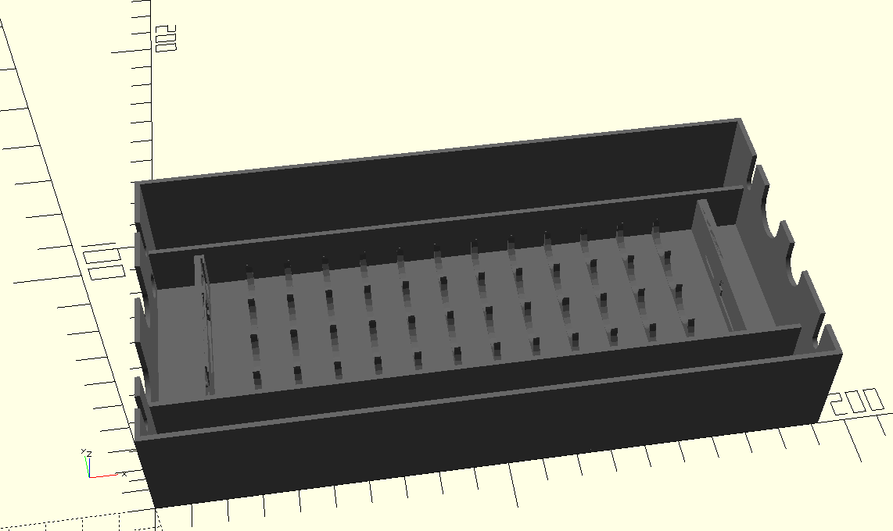

# kx3-battery-box
OpenSCAD experiment

This is an unfinished experiment with OpenSCAD.  The intent is/was to create a bigger battery pack for my Elecraft KX3.

This box is designed to hold 12 NiMH AA cells.

This is released under the Creative Commons CC-BY-SA "share-alike" license.  Have fun.
